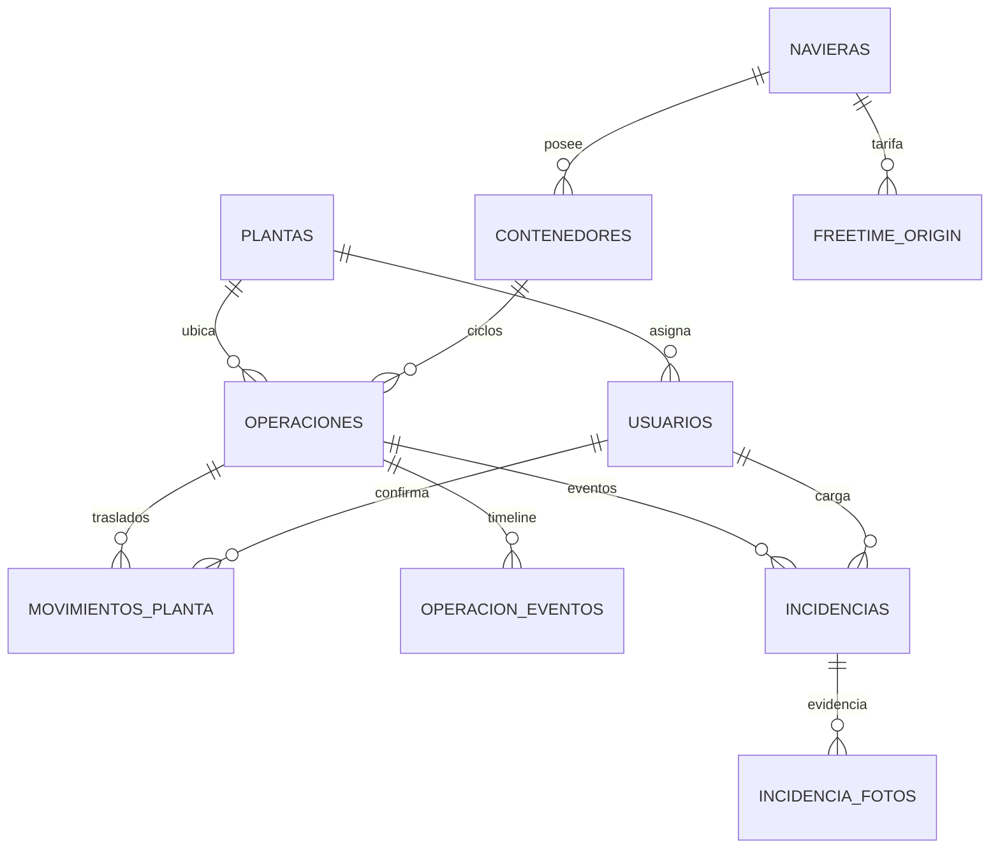
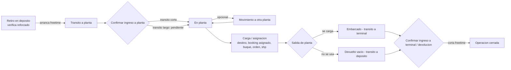

# Plan de Diseño — CRM Detention de Contenedores (Prototipo)
**SSB International × PBB Polisur (Dow) — Bahía Blanca, Argentina**
Fecha: 2026-07-02 · Estado: Fase 2 (diseño) en curso con John · Pendiente: cerrar estructura → Fase 3 (Claude Code)

SSB International gestiona la exportación de resinas de polietileno de PBB Polisur (Dow) desde Bahía Blanca (~300-400 contenedores/mes). Este documento planifica un CRM interno para trackear contenedores en detention — desde el retiro en depósito hasta el embarque o la devolución de vacío — con alertas de vencimiento de free time por naviera. Es la fuente única de verdad (spec) para la construcción con Claude Code.

---

## 0. Método de trabajo

- John aporta el conocimiento operativo. Claude (chat) asiste en diseño, plan y estructura **antes** de construir con Claude Code.
- Diseño visual **diferido**: primero funcionalidad y menos clics; el look & feel lo suma Claude Code después.
- Este `.md` se versiona en el proyecto dedicado del CRM para dar continuidad entre chats.

## 1. Objetivo y alcance

Prototipo funcional (no producción) para mostrarle al dueño de SSB la viabilidad y el tiempo de desarrollo. Auth y perfiles de usuario están incluidos porque son funcionalidad pedida (login, permisos por rol), no hardening. Se pospone: RLS fino, audit log, rate limiting.

Alcance funcional:
- Login con perfiles (operador, supervisor, administrador).
- Ingreso de contenedores **por tanda** (retiro en depósito → tránsito → confirmación de llegada a planta).
- Movimiento entre plantas (camión o tren).
- Egreso de contenedores **por tanda** (embarque o devolución de vacío) + confirmación de ingreso a terminal.
- Incidencias con fotos (avería sufrida o recepcionada).
- Dashboard (Inicio) con KPIs de costo + reporting de stock de vacíos.
- Panel de administración para actualizar bases (navieras, tarifas de free time versionadas, plantas, usuarios, umbral de alerta).
- Sistema de alertas de vencimiento de free time (banner al loguearse + solapa dedicada).

**Principio rector de UX: menos clics del operativo = mejor.** Es el criterio de desempate en cada decisión de flujo.

## 2. Hallazgos del histórico real (fundamento de las decisiones de esta sesión)

Fuentes: `DETENTION_HISTORIAL_DE_CONTENEDORES_2025-2026.xlsx` (2804 filas) y `free_time_origin.xlsx` (14 filas). Verificado sobre el dataset completo, no asumido:

- **2804 filas = 2804 contenedores únicos. 0% de recirculación** en ~1 año. Ningún contenedor se repite.
- **Naviera y tipo estables por contenedor** (0 conflictos): son propiedad del contenedor, no de la operación.
- **Retiros en tandas**: 417 tandas, mediana 4 / media 6.7 / máx 31 contenedores por tanda.
- **Por tanda**: naviera 100% uniforme, tipo 100% uniforme, depósito (retiro de) 98%, planta 99%.
- **Reforzado**: 2800 de 2804 son REFORZADO (99.86%).
- **Prefijo del contenedor → naviera**: solo 59% de cobertura (el resto son contenedores *leased*, con prefijo de lessor). → auto-detect por prefijo **descartado**, poco confiable.
- **Free time**: plano por naviera (días libres + tarifa USD/día + tipo Detention/Demurrage/Combined + flag de carga peligrosa). **No** varía por tipo de contenedor.
- Navieras en histórico: CMA/Mercosul, Hapag, Maersk, ZIM. Depósitos (retiro de): PTN, Exolgan, TRP, Gamma, Terminal 4, Huxley, Hiperbaires, etc.

**Implicancia de diseño (clave):** el lever de menos clics **no** es auto-resolver naviera/tipo por contenedor desde la DB (con 0% de recirculación, casi nunca dispara), sino **carga por tanda**: naviera, tipo, depósito, planta, booking y fecha se setean una vez para toda la tanda; el operativo solo pega la lista de números.

## 3. Decisiones de Arquitectura

| Decisión | Elegido | Por qué |
|---|---|---|
| Stack | Next.js + Supabase + Vercel | Vercel despliega Next.js nativo (push = deploy). Supabase SDK JS de primera. Python no tiene lugar en un CRM con frontend. |
| Proyecto Supabase | Nuevo, dedicado | `freetime_origin` (este proyecto, origen) es un dataset distinto a `detention_freetime` (destino, otro proyecto), sin join entre ellos. Aísla el prototipo. |
| Free time | Tabla propia `freetime_origin`, sembrada de `free_time_origin.xlsx` | Dataset de origen (retiro→cierre en Argentina), plano por naviera. |
| Dashboard | Ruta Next.js viva (Supabase en tiempo real) | El dashboard in-app es una página que lee la DB, no un HTML estático point-in-time. El HTML estático queda para un reporte exportable al dueño. |

## 4. Modelo de Datos (actualizado esta sesión)

Convenciones (aplicadas en la migration, sin excepción):
- Todo campo entre paréntesis `(a|b|...)` es `text` + `CHECK`, nunca `ENUM` nativo.
- Toda tabla lleva `created_at`/`updated_at timestamptz default now()`.
- Todo `fecha_*` es `timestamptz` (hay tránsito entre países y husos distintos).
- Soft delete donde aplique (`anulada` / `deleted_at`), nunca hard delete desde la app.

**Cambios clave vs la versión anterior del plan:**
- `naviera` y `tipo` pasan al **maestro de contenedores** (registro único, no cambian). No se piden por operación.
- `operaciones` pierde `naviera_id`, `destino`, `booking_asignado`, `buque`, `orden`, `shp` al alta. Gana `retiro_de`. Los campos de asignación se cargan en la **carga/egreso**, no al retiro.
- `estado` refleja las dos fases de tránsito (a planta / a terminal).
- Se agrega anulación (soft delete) y una tabla de **eventos** (timeline por operación).

```sql
plantas
  id, nombre (BAHIA | ABBOTT), codigo

navieras
  id, nombre                          -- normalizada; freetime_origin y contenedores referencian por FK (no string match)

freetime_origin                       -- VERSIONADO: nunca se pisa una tarifa, se inserta fila nueva. Plano por naviera.
  id, naviera_id FK, pais (ARGENTINA), dias_libres,
  aplica_carga_peligrosa bool, tipo (Detention|Demurrage|Combined),
  tarifa_usd_dia, vigente_desde, vigente_hasta nullable   -- null = vigente actual
  -- lookup: fila de la naviera donde fecha_retiro ∈ [vigente_desde, vigente_hasta]

usuarios
  id, email, nombre, rol (operador|supervisor|administrador),
  planta_asignada_id FK plantas nullable, activo bool

contenedores                          -- MAESTRO. Propiedades estables del contenedor (registro único).
  id, numero_contenedor UNIQUE, naviera_id FK, tipo (20DC|40DC|40HC),
  reforzado_estado (pendiente_validacion|confirmado_reforzado|confirmado_no_reforzado|discrepancia),
  reforzado_validado_por FK usuarios nullable, reforzado_fecha_validacion nullable
  -- naviera/tipo se setean al primer alta del contenedor y quedan fijos.

operaciones                           -- un ciclo de vida: retiro → cierre
  id, contenedor_id FK,
  retiro_de,                          -- depósito/terminal de retiro del vacío (PTN, Exolgan, ...)
  booking_retiro, fecha_retiro,       -- arranca freetime
  planta_actual_id FK plantas,        -- SOLO vía trigger de movimientos_planta, nunca escrito desde la app
  -- asignación (se cargan en la carga/egreso, NO al retiro):
  booking_asignado, buque, destino, orden, shp,
  fecha_egreso_planta nullable,       -- salida de planta (embarcado/devuelto)
  tipo_cierre (embarcado|devuelto_vacio|pendiente),
  fecha_devolucion nullable,          -- gate-in en terminal / devolución de vacío = CORTA freetime
  estado (en_transito_a_planta|en_planta|en_transito_a_terminal|cerrado|anulada),
  anulada_motivo nullable, anulada_por FK usuarios nullable
  -- GUARD: índice único parcial por contenedor_id WHERE estado NOT IN ('cerrado','anulada')
  --        (un contenedor no puede tener dos ciclos abiertos simultáneos)

movimientos_planta                    -- traslado inicial Y entre plantas (misma tabla). Acción desde la ficha.
  id, operacion_id FK,
  planta_origen_id FK plantas nullable,   -- null = primer tramo, viene de depósito
  planta_destino_id FK plantas, medio (camion|tren),
  fecha_salida, fecha_llegada_confirmada nullable,
  confirmado_por FK usuarios nullable, estado (en_transito|confirmado)
  -- TRIGGER AFTER estado='confirmado': UPDATE operaciones SET planta_actual_id = planta_destino_id

operacion_eventos                     -- TIMELINE por operación (historia + media auditoría gratis)
  id, operacion_id FK,
  tipo_evento (retiro|ingreso_planta|movimiento|carga|egreso|devolucion|anulacion|incidencia),
  fecha, usuario_id FK, detalle jsonb nullable

incidencias
  id, operacion_id FK, tipo (averia_sufrida|averia_recepcionada|otro),
  descripcion, fecha, usuario_id FK

incidencia_fotos
  id, incidencia_id FK, storage_path, uploaded_at   -- Supabase Storage
```



## 5. Ciclo de Vida del Contenedor (actualizado)

Al retiro **no** existen todavía destino, buque, booking asignado, orden ni SHP. Se verifica reforzado y arranca el freetime. La asignación se carga en la carga/egreso. El freetime **lo corta la confirmación de ingreso a terminal / devolución**, no la salida de planta.



**Nota plantas:** el histórico tiene un valor combinado `BAHIA/ABBOTT`. El modelo no lo replica — cada `movimientos_planta` apunta a una planta física. Dos plantas = dos movimientos.

**Reforzado:** se valida una vez por contenedor (maestro persistente). Default `confirmado_reforzado` (99.9% lo es); se marca la excepción.

## 6. Ingreso y Egreso — carga por tanda en dos fases (núcleo del rediseño)

Ambas solapas trabajan por **tanda** (lote) y en **dos fases**: fase 1 confirma el evento de la tanda; fase 2, en la misma solapa, lista los pendientes de confirmar la llegada.

### Ingreso
**Fase 1 · Tanda de retiro.** Encabezado seteado una vez para toda la tanda: `naviera, tipo, retiro_de (depósito), planta_destino, booking_retiro, fecha_retiro`. Debajo, caja para **pegar los números de contenedor** (uno por línea) → se parsean a una tabla. Naviera/tipo se toman del encabezado; si el contenedor ya existe en la base, se autocompletan y quedan fijos. `reforzado` viene tildado por default; se destilda la excepción. Un solo botón crea las N operaciones. Toggle **"confirmar ingreso a planta en el mismo momento"** (tránsito corto) cierra retiro + ingreso en un paso.

**Fase 2 · Pendientes de ingreso a planta.** Retiros en tránsito largo esperando llegada. Selección múltiple + `fecha_llegada` + `medio` → confirma el ingreso de los seleccionados.

### Egreso
**Fase 1 · Salida de planta.** Selección/pegado de contenedores en planta → `tipo_cierre (embarcado | devuelto_vacio)`. Si embarca, se cargan acá los datos de **asignación** por lote (`booking_asignado, buque, destino, orden, shp`). Confirma la salida (aún no corta freetime).

**Fase 2 · Pendientes de confirmar ingreso a terminal / devolución.** Salidos en tránsito. Selección múltiple + `fecha_devolucion` → **corta el freetime**.

## 7. Roles y Permisos (borrador — a confirmar)

| Acción | Operador | Supervisor | Administrador |
|---|---|---|---|
| Alta de tanda / confirmar ingreso a planta | ✅ (su planta) | ✅ (todas) | ✅ |
| Movimiento entre plantas | ✅ | ✅ | ✅ |
| Egreso / carga / confirmar devolución | ✅ | ✅ | ✅ |
| Cargar incidencia + fotos | ✅ | ✅ | ✅ |
| Validar reforzado | — | ✅ | ✅ |
| Anular operación | — | ✅ | ✅ |
| Ver stock / contenedores / alertas | Su planta | Todas | Todas |
| Reporting / exportar | — | ✅ | ✅ |
| Gestión de usuarios | — | — | ✅ |
| Configuración (navieras, tarifas, plantas, umbral) | — | — | ✅ |

## 8. Solapas / Módulos

| Solapa | Quién la ve | Info principal |
|---|---|---|
| Inicio (dashboard) | Todos (scoped por rol) | KPIs de costo + banner de alertas + accesos |
| Ingreso | Operador+ | Tanda de retiro (fase 1) + pendientes de ingreso a planta (fase 2) |
| Egreso | Operador+ | Salida de planta + asignación (fase 1) + pendientes de ingreso a terminal (fase 2) |
| Contenedores | Operador+ (filtrado por planta si operador) | Planilla + búsqueda global; ficha = timeline + movimiento entre plantas + incidencias + anular |
| Alertas | Operador+ | `vista_alertas`, ordenado por días restantes |
| Incidencias | Operador+ | Alta con fotos + historial por contenedor |
| Admin | Solo admin | Usuarios, navieras, tarifas free time (versionadas), plantas, umbral de alerta |

**Movimiento entre plantas:** acción dentro de la ficha del contenedor, no solapa top-level (es un evento sobre una operación existente).

## 9. Dashboard (Inicio)

KPIs de **plata** (es lo que le importa al dueño): costo de detention del mes / YTD, contenedores en riesgo (semáforo), stock de vacíos, demora promedio, costo por naviera (barras), tendencia mensual (línea). Ruta Next.js viva leyendo Supabase, scoped por rol (operador = su planta; supervisor/admin = todas).

## 10. Sistema de Alertas

```sql
vista_alertas (VIEW)
  operacion_id, contenedor_id, numero_contenedor, planta_actual, naviera,
  dias_transcurridos,                 -- computado en America/Argentina/Buenos_Aires, fecha_retiro = día 0
  dias_libres,                        -- join contenedor→naviera→freetime_origin (versión vigente a fecha_retiro)
  dias_restantes = dias_libres - dias_transcurridos,
  costo_proyectado = GREATEST(0, dias_transcurridos - dias_libres) * tarifa_usd_dia,
  estado_semaforo (verde|amarillo|rojo)
  WHERE operaciones.estado NOT IN ('cerrado','anulada')
```

Misma lógica que el Excel (`DEMORA = ESTADIA − DIAS LIBRES`; costo solo si demora > 0), automatizada. **Join por `naviera_id`, no por string** (el histórico y el free time nombran distinto: HAPAG vs HAPAG LLOYD, CMA/MERCOSUL vs CMA CGM). **Timezone AR** para evitar off-by-one. Umbral amarillo default 3 días, configurable en Admin.

## 11. Estándar CRM sumado esta sesión

- **Anulación** (soft delete) de operación cargada por error — distinta de cerrar.
- **Timeline por operación** (`operacion_eventos`): retiro → ingreso → carga → egreso → devolución.
- **Búsqueda global** (contenedor, orden, booking).
- **Validación ISO 6346** (dígito verificador) al pegar contenedores.
- **Estado "cargado"** en el ciclo (corta el stock de vacíos antes del embarque).
- **Estados vacío / carga / error + paginación** en los listados.
- **Realtime** (Supabase) en listados compartidos: sí.
- **Guard**: una sola operación abierta por contenedor (índice parcial).
- **Carga masiva**: se prueba en etapa de testing, no en la demo.

## 12. Fase 3 — Construcción con Claude Code

Objetivo: CRM funcional con mínima intervención manual de John (loop autónomo, no gate por paso). Sin riesgos (interno, desde cero, DB nueva).

- `spec.md` = este documento. Fuente única de verdad; nadie improvisa fuera de él.
- Subagentes (`.claude/agents/`): `schema-builder` (migrations, Supabase MCP), `ui-builder` (un módulo por iteración, filesystem + bash), `reviewer` (read-only, aprueba/rebota contra el spec), `verifier` (build + E2E básico + deploy Vercel).
- Ciclo por módulo: EXPLORE → PLAN → IMPLEMENT → VERIFY.
- Checkpoints humanos mínimos: spec aprobado antes del loop, y verify final antes de mostrárselo al dueño. Dentro del loop, sin preguntas.
- Modelo `claude-opus-4-8`, `/effort xhigh`.

## 13. Decisiones tomadas (changelog de esta sesión)

- Naviera y tipo → maestro de contenedores (registro único).
- Ingreso y egreso → carga por tanda en dos fases (fundamentado en 417 tandas, 100% naviera/tipo uniforme).
- Destino, booking asignado, buque, orden, SHP → salen del retiro, se cargan en carga/egreso.
- Free time → plano por naviera + vigencia (confirmado contra el Excel real). Join por `naviera_id`.
- Free time editable desde Admin insertando versión nueva, nunca UPDATE.
- Días computados en `America/Argentina/Buenos_Aires`, retiro = día 0.
- Reforzado default tildado; se marca la excepción.
- Auto-detect de naviera por prefijo → descartado (solo 59% de cobertura).
- Inicio = dashboard. Movimiento entre plantas = acción en la ficha. Admin = panel único.
- Sumados los estándar CRM del §11.
- Diseño visual diferido a Claude Code; foco actual en funcionalidad y menos clics.

## 14. Decisiones pendientes / a confirmar

1. **Carga / asignación**: propuesta = plegarla dentro del egreso-embarque (para cuando embarca ya se tienen los datos, ahorra una solapa). Alternativa = instancia propia "cargado" dentro de la planta, antes de la salida. **A confirmar por John.**
2. **Umbral de alerta**: default 3 días. Confirmar.
3. **Operador sin planta asignada**: ¿ve todas, o no aplica ese caso?
4. **Movimiento entre plantas**: decidido como acción en la ficha; confirmar si se quiere como solapa top-level.

## 15. Continuidad entre chats — estado actual

**Qué hicimos esta sesión:** revisión crítica del plan original, análisis del histórico real (2804 filas) y del free time real (14 filas), y rediseño del flujo de ingreso/egreso a carga por tanda en dos fases. Se corrigió el modelo (naviera/tipo al maestro, destino fuera del retiro) y se sumaron estándar de CRM faltantes.

**Decisiones principales:** carga por tanda; naviera/tipo en el maestro; asignación en carga/egreso; free time plano por naviera con join por FK; dashboard = Inicio; movimiento = ficha; loop autónomo en Fase 3.

**Estado:** diseño de estructura y funcionalidad casi cerrado. Falta resolver los 4 puntos del §14 (principal: dónde va la carga/asignación).

**Próximos pasos:** (1) John da devolución sobre el prototipo visual de las solapas operativas. (2) Cerrar §14. (3) Congelar este `spec.md`. (4) Arrancar Fase 3 en Claude Code con el loop de subagentes.
