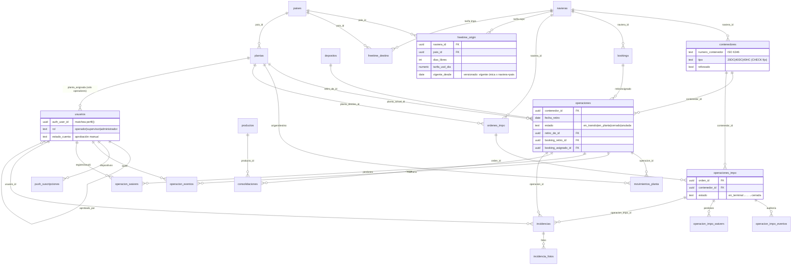

# ERD — schema `crm` (generado desde prod, 2026-08-02)

Fuente: `information_schema` del proyecto `cctuowthpnstvdgjuomq` (50 FKs). Las
**vistas del motor** (`vista_alertas`, `vista_kpi_costos_cerradas` y espejos impo,
`vista_bookings_saldo`, `vista_carga_actual`, `vista_stock_prefijos_restringidos`,
KPIs) no aparecen: son derivadas — la regla de fuente única vive en AGENTS.md.

## Lectura rápida

- **Dos ciclos espejo**: expo (`operaciones`, retiro→planta→devolución) e impo
  (`ordenes_impo`→`operaciones_impo`, terminal→planta→devolución). Comparten
  `contenedores`, `navieras`, `plantas`, `incidencias`.
- **La plata no vive en tablas de saldo**: se deriva SIEMPRE en las vistas del
  motor desde fechas + tarifario versionado. Waivers restan como NETO.
- **Escritura**: todo el money path es RPC-only (SECURITY DEFINER
  owner=`crm_rpc_executor`/postgres) — ver la lista sancionada en AGENTS.md.
- **Auditoría**: `operacion_eventos`/`operacion_impo_eventos` registran cada
  acción con usuario; los 20 FKs a `usuarios` son el rastro de "quién".
