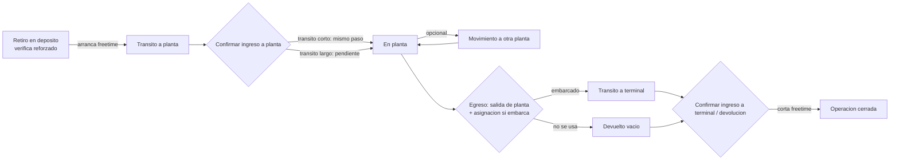

# Spec v2.1 — CRM Detention de Contenedores (Rebuild funcional)
**SSB International × PBB Polisur (Dow) — Bahía Blanca, Argentina**
Fecha: 2026-07-07 · Estado: spec congelado → Fase 3 (Claude Code) · Reemplaza al plan del 2026-07-02
**Modalidad: REBUILD v2 en este repo (Crm-containers), con la v1 viva en producción. Reglas de convivencia y cutover: §21 — leerlo antes que §17.**
Fuente única de verdad; nadie improvisa fuera de él.

**Cambio de objetivo respecto de v1:** deja de ser una demo. El target es un **CRM 100% funcional y profesional**: auth real con auto-registro y aprobación, permisos por rol y planta efectivos (RLS), notificaciones de pendientes, ayuda integrada, y look & feel Flight Deck desde el día uno. John delegó las decisiones abiertas del plan anterior (§14 de aquel documento) — quedan cerradas acá con supuestos explícitos y vetables (§19).

---

## 0. Método de trabajo

- John aporta el conocimiento operativo. Claude (chat) cerró diseño y estructura; Claude Code construye.
- Ciclo por módulo: EXPLORE → PLAN → IMPLEMENT → VERIFY. Loop autónomo dentro del plan aprobado; checkpoints humanos definidos en §17.
- Este `spec.md` se versiona en el repo para dar continuidad entre sesiones.

## 1. Objetivo y alcance

CRM interno funcional para trackear contenedores en detention — desde el retiro en depósito hasta el embarque o la devolución de vacío — con alertas de vencimiento de free time por naviera. Sirve además como pieza de presentación al dueño de SSB y como semilla/template del pipeline de generación automática de CRMs (proyecto paralelo).

**Entra en v2 (cambios vs el plan anterior):**
- Auth real: auto-registro con email + aprobación por administración (§12).
- **RLS mínima viable** (§14). Antes estaba pospuesta; con registro abierto en una URL pública deja de ser posponible: la `anon key` es pública y sin RLS cualquier registrado (o cualquiera con la key) lee todo el schema vía PostgREST. No es hardening opcional: es la puerta.
- Notificaciones de pendientes por rol: campana + popup al login (§13).
- Ayuda integrada: guía por solapa, FAQ, empty states instructivos (§15).
- Diseño **Flight Deck** (dark near-black + cyan + JetBrains Mono) reutilizado de la v1 en producción. Decisión, no opción: sistema ya probado, identidad interna ya instalada, cero tiempo de exploración visual.
- Catálogo "menos toques" (§6.3) + automatizaciones F2 (§16), incluida la carga por foto (OCR).

**Sigue fuera de alcance (non-goals):**
- Rate limiting, MFA, SSO corporativo — v3 si el CRM pasa a uso masivo.
- Audit log formal separado — `operacion_eventos` con triggers automáticos cubre la trazabilidad operativa (§4).
- Carga masiva de histórico — se prueba en testing, no en el build inicial.
- Integraciones con APIs de navieras / EDI — parking lot comercial.
- App móvil nativa — la web es responsive; el caso móvil real (foto en depósito) lo cubre §16.1.
- **Cutover v1→v2** — fase propia posterior al build, ver §21.5.

## 2. Hallazgos del histórico real (fundamento)

Fuentes: `DETENTION HISTORIAL DE CONTENEDORES AÑO-DE AGOSTO 2025-2026.xlsx` (2804 filas) y `free time origin.xlsx` (14 filas), ambos en la raíz del repo. Verificado sobre el dataset completo:

- **2804 filas = 2804 contenedores únicos. 0% de recirculación** en ~1 año.
- **Naviera y tipo estables por contenedor** (0 conflictos): propiedad del contenedor, no de la operación.
- **Retiros en tandas**: 417 tandas, mediana 4 / media 6.7 / máx 31.
- **Por tanda**: naviera 100% uniforme, tipo 100%, depósito 98%, planta 99%.
- **Reforzado**: 2800/2804 (99.86%).
- **Prefijo → naviera: solo 59% de cobertura** (contenedores leased). Auto-detect como autofill: descartado. Como validación soft: ver §6.3.
- **Free time**: plano por naviera (días libres + USD/día + tipo + flag peligrosa). No varía por tipo de contenedor.
- Navieras: CMA/Mercosul, Hapag, Maersk, ZIM. Depósitos: PTN, Exolgan, TRP, Gamma, Terminal 4, Huxley, Hiperbaires, etc.

**Implicancia clave:** el lever de menos clics es la **carga por tanda** (encabezado una vez, lista pegada), no la auto-resolución por contenedor.

## 3. Decisiones de Arquitectura

| Decisión | Elegido | Por qué |
|---|---|---|
| Stack | Next.js (App Router) + TypeScript + Tailwind + Supabase + Vercel | Mismo stack probado en la v1. |
| Proyecto Supabase | **Nuevo, dedicado** | Aísla el rebuild de la DB de producción (§21). `freetime_origin` es dataset distinto al de destino. |
| Auth | Supabase Auth (email + password, confirmación de email ON) | Nativo, sin servicio extra. Aprobación por admin encima (§12). |
| Lógica de negocio | **Exclusivamente en views y RPCs de Supabase** | El frontend nunca recalcula nada. Principio heredado de la v1. |
| Diseño | Flight Deck | Reuso del design system existente. |
| Dashboard | Ruta Next.js viva (Supabase realtime) | El HTML estático queda solo como reporte exportable al dueño (parking lot). |

## 4. Modelo de Datos

Convenciones (sin excepción):
- Todo campo entre paréntesis `(a|b|...)` es `text` + `CHECK`, nunca ENUM nativo.
- Toda tabla lleva `created_at`/`updated_at timestamptz default now()`.
- Todo `fecha_*` es `timestamptz`. Cómputos de días en `America/Argentina/Buenos_Aires`.
- Soft delete donde aplique; nunca hard delete desde la app.
- **RLS habilitado en todas las tablas del schema** (§14).
- **Views siempre con `security_invoker = true`** (el bypass default de RLS en views es el error clásico).

```sql
plantas
  id, nombre (BAHIA | ABBOTT), codigo

navieras
  id, nombre                          -- normalizada; todo referencia por FK, nunca string match

freetime_origin                       -- VERSIONADO: nunca UPDATE de tarifa, siempre fila nueva
  id, naviera_id FK, pais (ARGENTINA), dias_libres,
  aplica_carga_peligrosa bool, tipo (Detention|Demurrage|Combined),
  tarifa_usd_dia, vigente_desde, vigente_hasta nullable   -- null = vigente
  -- lookup: fila de la naviera donde fecha_retiro ∈ [vigente_desde, vigente_hasta]

usuarios                              -- CAMBIA en v2: ciclo de aprobación
  id, auth_user_id uuid UNIQUE FK auth.users, email, nombre,
  rol (operador|supervisor|administrador) nullable,      -- null hasta aprobación
  planta_asignada_id FK plantas nullable,
  estado_cuenta (pendiente_aprobacion|activo|rechazado|suspendido) default 'pendiente_aprobacion',
  aprobado_por FK usuarios nullable, fecha_aprobacion nullable
  -- CHECK: rol='operador' ⇒ planta_asignada_id NOT NULL (decisión §18.3)
  -- rol y estado_cuenta NUNCA editables por el propio usuario (solo RPC de admin, §14)

contenedores                          -- MAESTRO: propiedades estables, registro único
  id, numero_contenedor UNIQUE, naviera_id FK, tipo (20DC|40DC|40HC),
  reforzado_estado (pendiente_validacion|confirmado_reforzado|confirmado_no_reforzado|discrepancia),
  reforzado_validado_por FK usuarios nullable, reforzado_fecha_validacion nullable
  -- Se crea AUTOMÁTICAMENTE como side-effect del alta de tanda (§6.3). No hay pantalla de alta.

operaciones                           -- un ciclo de vida: retiro → cierre
  id, contenedor_id FK,
  retiro_de, booking_retiro, fecha_retiro,               -- arranca freetime
  planta_actual_id FK plantas,                            -- SOLO vía trigger de movimientos_planta
  booking_asignado, buque, destino, orden, shp,           -- se cargan en el egreso-embarque (§18.1)
  fecha_egreso_planta nullable,
  tipo_cierre (embarcado|devuelto_vacio|pendiente),
  fecha_devolucion nullable,                              -- gate-in terminal = CORTA freetime
  estado (en_transito_a_planta|en_planta|en_transito_a_terminal|cerrado|anulada),
  anulada_motivo nullable, anulada_por FK usuarios nullable
  -- GUARD: índice único parcial por contenedor_id WHERE estado NOT IN ('cerrado','anulada')

movimientos_planta
  id, operacion_id FK, planta_origen_id FK nullable,      -- null = primer tramo desde depósito
  planta_destino_id FK, medio (camion|tren),
  fecha_salida, fecha_llegada_confirmada nullable,
  confirmado_por FK usuarios nullable, estado (en_transito|confirmado)
  -- TRIGGER AFTER estado='confirmado': UPDATE operaciones SET planta_actual_id = planta_destino_id

operacion_eventos                     -- TIMELINE. En v2: poblada por TRIGGERS, no por la app
  id, operacion_id FK,
  tipo_evento (retiro|ingreso_planta|movimiento|carga|egreso|devolucion|anulacion|incidencia),
  fecha, usuario_id FK, detalle jsonb nullable
  -- Triggers AFTER INSERT/UPDATE en operaciones, movimientos_planta e incidencias insertan
  -- el evento correspondiente. La app no escribe eventos: auditoría garantizada, cero esfuerzo.

incidencias
  id, operacion_id FK, tipo (averia_sufrida|averia_recepcionada|otro),
  descripcion, fecha, usuario_id FK

incidencia_fotos
  id, incidencia_id FK, storage_path, uploaded_at         -- bucket privado 'incidencias'

configuracion                         -- NUEVA: key-value editable desde Admin
  clave PK, valor jsonb, updated_by FK usuarios, updated_at
  -- seeds: umbral_alerta_amarillo=3, dominios_sugeridos=["ssbint.com"]

ayuda_contenido                       -- NUEVA: banco de consultas editable desde Admin
  id, seccion (ingreso|egreso|contenedores|alertas|incidencias|admin|dashboard|faq),
  titulo, contenido_md, orden, publicado bool default true
```

**RPCs (security definer, lógica en DB):** `aprobar_usuario(usuario_id, rol, planta_id)` y `rechazar_usuario(usuario_id, motivo)` — solo admin; `get_pendientes()` — devuelve el jsonb de notificaciones según el rol del caller (§13); `perfil()` — helper stable que resuelve (usuario_id, rol, planta, estado) desde `auth.uid()` para las policies.

**Seeds de migración:** plantas (BAHIA, ABBOTT), navieras del histórico, las 14 filas de `free time origin.xlsx` (raíz del repo), configuración inicial, contenido de ayuda inicial (§15), y el **usuario admin bootstrap** (jzenteno@ssbint.com, estado `activo`, rol `administrador`) — sin esto nadie puede aprobar a nadie.

## 5. Ciclo de Vida del Contenedor

Al retiro no existen destino, buque, booking asignado, orden ni SHP: se cargan en el egreso-embarque (§18.1). El freetime lo corta la confirmación de ingreso a terminal / devolución, no la salida de planta.



**Plantas:** cada `movimientos_planta` apunta a una planta física. Dos plantas = dos movimientos. **Reforzado:** default `confirmado_reforzado`; se marca la excepción.

## 6. Ingreso y Egreso — tanda en dos fases

### 6.1 Ingreso
**Fase 1 · Tanda de retiro.** Encabezado una vez para toda la tanda: `naviera, tipo, retiro_de, planta_destino, booking_retiro, fecha_retiro`. Caja para pegar números de contenedor (uno por línea) → tabla parseada en vivo. Un botón crea las N operaciones. Toggle **"confirmar ingreso a planta en el mismo momento"** cierra retiro + ingreso en un paso.

**Fase 2 · Pendientes de ingreso a planta.** Selección múltiple + `fecha_llegada` + `medio` → confirma.

### 6.2 Egreso
**Fase 1 · Salida de planta.** Selección de contenedores en planta → `tipo_cierre`. Si embarca, acá se cargan los datos de **asignación** por lote (`booking_asignado, buque, destino, orden, shp`). Confirma la salida (aún no corta freetime).

**Fase 2 · Pendientes de terminal/devolución.** Selección múltiple + `fecha_devolucion` → **corta el freetime**.

### 6.3 Catálogo "menos toques" (núcleo v2 — cada ítem es requisito, no sugerencia)

1. **Alta automática del maestro.** El operativo pega números; el sistema resuelve por línea, en vivo: existe en `contenedores` → badge "existente", naviera/tipo autocompletados y fijos; no existe → badge "nuevo", se crea con el submit de la tanda usando naviera/tipo del encabezado. **No existe pantalla de alta de contenedor.**
2. **Parser tolerante.** Acepta `MSKU 123456-7`, minúsculas, espacios, guiones, separado por coma/tab/newline → normaliza a `MSKU1234567`. Dedup dentro de la tanda.
3. **Validación viva, antes del submit:** dígito verificador ISO 6346 por línea (error bloqueante); duplicado contra ciclo abierto (guard) mostrado por línea (bloqueante); conflicto naviera/tipo del maestro vs encabezado (bloqueante con explicación).
4. **Prefijo → naviera como warning, no autofill.** El 59% de cobertura lo descartó como autofill, pero como validación soft sirve: si el prefijo mapea a una naviera *distinta* a la del encabezado → ícono de advertencia no bloqueante. Falsos positivos esperables por leasing; es señal, no regla.
5. **Repetir última tanda.** Botón que precarga el encabezado con los valores de la última tanda del usuario. Con mediana de 4 contenedores por tanda y carga diaria, esto ahorra más clics que cualquier otra cosa.
6. **Defaults:** `fecha_retiro` = hoy; `reforzado` tildado; planta = planta del operador.
7. **Egreso por pegado inverso:** además de tildar de la lista, se puede pegar una lista de números y el sistema selecciona los que están en planta (reporta los que no).
8. **Eventos por trigger** (§4): la auditoría se escribe sola.
9. **Realtime** en listados compartidos (fase 2 de ingreso/egreso, alertas): si otro operador confirma, desaparece de tu lista sin refresh.

## 7. Roles y Permisos

| Acción | Pendiente | Operador | Supervisor | Administrador |
|---|---|---|---|---|
| Acceso a datos | ❌ (pantalla de espera) | Su planta | Todas | Todas |
| Alta tanda / confirmar ingreso | — | ✅ (su planta) | ✅ | ✅ |
| Movimiento entre plantas | — | ✅ | ✅ | ✅ |
| Egreso / asignación / confirmar devolución | — | ✅ | ✅ | ✅ |
| Incidencias + fotos | — | ✅ | ✅ | ✅ |
| Validar reforzado | — | — | ✅ | ✅ |
| Anular operación | — | — | ✅ | ✅ |
| Reporting / exportar | — | — | ✅ | ✅ |
| Aprobar/rechazar usuarios | — | — | — | ✅ |
| Configuración (navieras, tarifas, plantas, umbral, ayuda) | — | — | — | ✅ |

Operador siempre tiene planta asignada (constraint §4). El scope por planta se aplica en **RLS**, no solo en la UI.

## 8. Solapas / Módulos

| Solapa | Quién | Contenido |
|---|---|---|
| Inicio (dashboard) | Todos los activos (scoped) | KPIs de costo + accesos rápidos |
| Ingreso | Operador+ | Tanda (F1) + pendientes de ingreso (F2) |
| Egreso | Operador+ | Salida + asignación (F1) + pendientes terminal (F2) |
| Contenedores | Operador+ (scoped) | Planilla + búsqueda global; ficha = timeline + movimiento + incidencias + anular |
| Alertas | Operador+ | `vista_alertas` ordenada por días restantes |
| Incidencias | Operador+ | Alta con fotos + historial |
| Admin | Solo admin | Solicitudes de acceso, usuarios, navieras, tarifas versionadas, plantas, configuración, editor de ayuda |
| Ayuda / FAQ | Todos los activos | Banco de consultas completo (§15) |

**Header persistente:** campana de notificaciones con badge (§13) + búsqueda global + ícono "?" contextual por solapa.

## 9. Dashboard (Inicio)

KPIs de plata: costo detention mes / YTD, contenedores en riesgo (semáforo), stock de vacíos, demora promedio, costo por naviera (barras), tendencia mensual (línea). Todo desde views de Supabase, scoped por rol vía RLS.

## 10. Sistema de Alertas

```sql
vista_alertas (VIEW, security_invoker = true)
  operacion_id, contenedor_id, numero_contenedor, planta_actual, naviera,
  dias_transcurridos,                 -- America/Argentina/Buenos_Aires, fecha_retiro = día 1
                                      -- (conteo INCLUSIVO, validado 2.804/2.804 vs Excel
                                      --  histórico — docs/EXPLORE-M4.md F0; corregido en M4:
                                      --  este comentario decía "día 0" y estaba MAL)
  dias_libres,                        -- join naviera→freetime_origin (versión vigente a fecha_retiro)
  dias_restantes,
  costo_proyectado = GREATEST(0, dias_transcurridos - dias_libres) * tarifa_usd_dia,
  estado_semaforo (verde|amarillo|rojo)
  WHERE estado NOT IN ('cerrado','anulada')
```

Join por `naviera_id`, nunca string. Umbral amarillo desde `configuracion` (default 3 — decisión §18.2).

## 11. Estándar CRM

- Anulación (soft delete) distinta de cerrar.
- Timeline por operación (por triggers).
- Búsqueda global (contenedor, orden, booking).
- Validación ISO 6346 al pegar.
- Estados vacío / carga / error + paginación en listados. Los **empty states son instructivos** (§15).
- Realtime en listados compartidos.
- Guard: una operación abierta por contenedor.
- ~~Estado "cargado"~~ — eliminado por la decisión §18.1 (asignación plegada en el egreso). Si a futuro aparece gap real entre carga y salida, se agrega como iteración: el enum es `text+CHECK`, migración trivial.

## 12. Autenticación y aprobación de usuarios (NUEVO)

**Flujo:**
1. **Registro abierto:** pantalla de signup (nombre, email, password) → Supabase Auth con confirmación de email → trigger crea fila en `usuarios` con `estado_cuenta='pendiente_aprobacion'`, rol null.
2. **Pantalla de espera:** autenticado pero no aprobado → "Tu cuenta espera aprobación de administración" + logout. **Cero acceso a datos** (garantizado por RLS, no por la UI).
3. **Aprobación:** los admins ven la solicitud en la campana y en Admin → "Solicitudes de acceso". Aprobar = asignar rol + planta (obligatoria si operador) vía RPC `aprobar_usuario`. Rechazar = estado `rechazado` con motivo.
4. **Dominio:** los emails fuera de `dominios_sugeridos` (config) se marcan con warning en la lista de solicitudes, pero **no se bloquean** — el gate es la aprobación humana. Enforcement duro por dominio: v3 si se decide.
5. **Suspensión:** admin puede pasar a `suspendido` (pierde acceso inmediato vía RLS) sin borrar historial.

**Login:** email + password, Flight Deck, logos SSB/Dow (patrón SVG ya resuelto en la v1). "Olvidé mi contraseña" con reset de Supabase Auth.

## 13. Notificaciones de pendientes (NUEVO)

**Fuente única:** RPC `get_pendientes()` — resuelve el rol del caller y devuelve jsonb por categoría. La lógica vive en la DB.

| Categoría | Operador (su planta) | Supervisor | Admin |
|---|---|---|---|
| Pendientes de confirmar ingreso a planta | ✅ | ✅ todas | ✅ |
| Pendientes de confirmar terminal/devolución | ✅ | ✅ todas | ✅ |
| Alertas amarillo/rojo | ✅ | ✅ todas | ✅ |
| Reforzados en `pendiente_validacion` / `discrepancia` | — | ✅ | ✅ |
| Solicitudes de acceso pendientes | — | — | ✅ |

**UI:** (a) **popup modal al login** si hay pendientes — resumen por categoría con link directo a cada solapa; (b) **campana en el header** con badge de conteo y dropdown, refetch al recuperar foco de ventana. Push/realtime sobre la campana: F2.

## 14. Seguridad mínima viable (NUEVO — reemplaza el "se pospone RLS" del plan anterior)

Contexto que obliga: URL pública + registro abierto + `anon key` embebida en el cliente. La evidencia sobre apps Supabase construidas con IA es contundente (98% con problemas de seguridad; ~83% de las exposiciones por RLS mal configurada). Esto NO es el hardening pospuesto (rate limiting, MFA, pentest) — es el mínimo para que el registro abierto no sea un agujero.

**Reglas (el `reviewer` rebota cualquier PR que las viole):**
1. **RLS ON en todas las tablas** del schema, sin excepción. Tabla nueva = RLS + policies en la misma migración.
2. Helper `perfil()` (security definer, stable) desde `auth.uid()`; policies lo referencian. `auth.uid()` siempre envuelto en `(select ...)` por performance.
3. **Estado ≠ 'activo' ⇒ ninguna policy matchea.** Pendiente/rechazado/suspendido no leen nada.
4. **Scope por planta en RLS**: operador solo ve operaciones con `planta_actual_id` = su planta (y sus fases de tránsito asociadas); supervisor/admin todas. Maestros (contenedores, navieras, freetime, plantas, ayuda) legibles por cualquier activo.
5. **Escrituras según §7**, por operación (INSERT/UPDATE separadas; UPDATE con USING + WITH CHECK; recordar que UPDATE...RETURNING vía PostgREST requiere también policy de SELECT). Sin DELETE desde la app: anulación = UPDATE.
6. **`usuarios`:** cada uno lee su propia fila; listado completo solo admin. `rol`, `estado_cuenta`, `planta_asignada_id` solo mutables vía RPCs de admin. Nombres para joins (confirmado_por, etc.) vía view `usuarios_publicos(id, nombre)` con security_invoker.
7. **Nunca autorización por `user_metadata`** (editable por el usuario). La verdad vive en la tabla `usuarios`.
8. **Views con `security_invoker = true`** — siempre.
9. **Storage:** bucket `incidencias` privado; policies de insert/select solo para activos.
10. **Build con `supabase/agent-skills` instalado** (ya está en `.agents/skills/`): el `schema-builder` y el `reviewer` operan con las best practices de Postgres/RLS cargadas. Gate final: auditoría de RLS (checklist + intento de lectura anónima con la anon key contra cada tabla) antes del VERIFY final.

## 15. Ayuda integrada / banco de consultas (NUEVO)

Objetivo: que cualquier persona que entre por primera vez entienda cómo usar cada solapa sin que nadie le explique.

1. **Ícono "?" por solapa** → panel lateral con el contenido de `ayuda_contenido` de esa sección: qué es la solapa, qué completa cada campo, el flujo en 3-5 pasos.
2. **Solapa Ayuda/FAQ**: todo el banco navegable + preguntas frecuentes (¿qué corta el freetime?, ¿qué es una anulación?, ¿qué hago si el contenedor ya tiene ciclo abierto?, ¿cómo se aprueba un usuario nuevo?).
3. **Empty states instructivos**: cada listado vacío explica qué aparece ahí y desde dónde ("No hay pendientes de terminal. Los contenedores que salen de planta aparecen acá hasta confirmar su ingreso a terminal, que corta el freetime.").
4. **Editable desde Admin** (editor markdown simple sobre `ayuda_contenido`): actualizar la ayuda no requiere deploy.
5. **Seed:** el `ui-builder` genera el contenido inicial de cada sección **desde este spec** al construir cada módulo — la ayuda sale gratis del propio documento.

## 16. Automatizaciones F2 (post-core; la idea queda especificada)

### 16.1 Ingreso por foto (OCR de contenedores) — alto valor demo
- Botón **"Cargar desde foto"** en Ingreso F1 (pensado mobile: el operario en el depósito). Acepta 1–N fotos de puertas de contenedores.
- Pipeline: resize client-side → route handler → **Claude API con visión** (`claude-sonnet-4-6`; escalar solo si el accuracy real lo pide) con prompt de extracción de códigos ISO 6346 → respuesta JSON → **el server valida el dígito verificador de cada código** → válidos se vuelcan al textarea de la tanda; dudosos quedan marcados para corrección manual.
- **El check digit es la red determinística**: un error de lectura casi siempre rompe el dígito → se detecta, no se cuela.
- **Nunca crea nada solo**: la foto llena el textarea; la confirmación humana de la tanda queda intacta.
- Guardrails: máx. fotos por request, límite de tamaño, API key solo server-side.

### 16.2 Digest de alertas por email (n8n)
Workflow en n8n Cloud (stack existente): cron 08:00 AR → query a `vista_alertas` (service key, solo lectura) → email a supervisores con amarillos/rojos y costo proyectado. Un workflow, cero código en el CRM.

### 16.3 Otros F2
- Realtime/push sobre la campana de notificaciones.
- Carga masiva del histórico (testing).
- Export CSV/Excel de listados (supervisor+).
- Reporte HTML exportable para el dueño (point-in-time).

**Parking lot comercial (v3+):** integración con tracking de navieras (API/EDI), portal de solo-lectura para el dueño, y reutilización de este spec como template del pipeline de generación automática de CRMs.

## 17. Fase 3 — Ejecución con Claude Code

**Setup:** `spec.md` = este documento. Subagentes en `.claude/agents/`: `schema-builder` (migrations, Supabase MCP), `ui-builder` (un módulo por iteración), `reviewer` (read-only, aprueba/rebota contra spec + reglas §14 + estándar de interfaz), `verifier` (build + E2E básico; deploy manual de John). `supabase/agent-skills` ya instalado. **Sin Agent Teams**: ~7x tokens con el tope del 50% del cupo semanal es quedarse sin nafta a mitad del loop; los subagentes secuenciales alcanzan.

**Git e infraestructura: regidos por §21** — branch `v2-rebuild`, Supabase nuevo, Vercel nuevo. La v1 no se toca.

**Modelo:** Fable 5 como primario mientras dure la ventana (Claude Code ≥ 2.1.170), effort alto en PLAN, estándar en IMPLEMENT. Si el cupo se agota: `/model claude-opus-4-8` y el loop sigue — **nada del spec depende del modelo**.

**Orden de build (prioridad estricta; core primero, pulido después):**

| # | Módulo | Incluye | Checkpoint humano |
|---|---|---|---|
| M0 | Scaffold + shell Flight Deck | Next.js, Tailwind, tokens del design system, layout, login estático | — |
| M1 | Schema completo + RLS + triggers + seeds | Todo §4 y §14 en migraciones | ✅ **CP1: revisar schema+RLS antes de seguir** |
| M2 | Auth + aprobación | Signup, espera, mini-panel de solicitudes, RPCs | ✅ **CP2 (rápido): flujo registro→aprobación→login funciona** |
| M3 | Ingreso (F1+F2) | Tanda completa + catálogo §6.3 (1–7) | — |
| M4 | Egreso (F1+F2) | Salida + asignación + corte de freetime | — |
| M5 | Contenedores | Planilla, búsqueda, ficha (timeline, movimiento, anular) | — |
| M6 | Alertas + notificaciones | `vista_alertas`, solapa, campana, popup login | — |
| M7 | Dashboard | KPIs §9 | — |
| M8 | Admin completo | Usuarios, navieras, tarifas versionadas, plantas, config, editor ayuda | — |
| M9 | Incidencias | Alta + fotos (storage privado) | — |
| M10 | Ayuda + FAQ + empty states | §15 completo, seed desde spec | ✅ **CP3: VERIFY final + auditoría RLS (§14.10) + pasada de pulido visual con capturas** |
| F2 | §16 | OCR foto → digest n8n → export → carga masiva | según sobre tiempo |

Dentro de cada módulo: loop autónomo sin preguntas. Deploy siempre manual (`npx vercel deploy --prod --yes`). Commits atómicos, branch por módulo.

**Expectativa realista:** M0–M6 en una sesión larga; M7–M10 en la siguiente. La ventana de Fable va hasta el 12/07 — no comprimir a costa de saltear checkpoints.

## 18. Decisiones cerradas (changelog v2)

Delegadas por John el 07-07 ("libre albedrío"), cerradas con criterio de menos toques + consistencia:

1. **Carga/asignación → plegada en el egreso-embarque.** Una solapa menos; los datos existen al embarcar. Consecuencia: se elimina el estado "cargado" (resolvía una inconsistencia: el enum de `operaciones.estado` nunca lo incluyó). **Supuesto:** carga y salida de planta ocurren ~el mismo día. Si hay gap real de días, el KPI de stock de vacíos sobrecontaría — en ese caso se agrega el estado como iteración (migración trivial).
2. **Umbral de alerta = 3 días**, editable en `configuracion`.
3. **Operador siempre con planta asignada** (constraint en DB + validación en aprobación). El caso "operador volante" no se modela; si existe, se cubre con rol supervisor.
4. **Movimiento entre plantas = acción en la ficha** (confirmado; evento de baja frecuencia sobre operación existente).

Nuevas decisiones v2:
5. De demo a **CRM funcional**: auth real con auto-registro + aprobación admin (§12).
6. **RLS mínima viable entra al alcance** — consecuencia directa del registro abierto (§14).
7. **Flight Deck** como design system (reuso, no exploración).
8. Notificaciones por rol: RPC única + campana + popup al login (§13).
9. Ayuda integrada editable + empty states instructivos + seed desde el spec (§15).
10. Catálogo "menos toques" como requisito (§6.3), incluyendo alta automática del maestro y prefijo→naviera como warning soft (reintroducido con rol distinto al descartado antes).
11. OCR por foto especificado como F2 con confirmación humana obligatoria (§16.1).
12. Eventos de timeline por triggers, no desde la app (§4).
13. Fase 3: Fable 5 primario con fallback a `claude-opus-4-8`, sin Agent Teams, orden M0–M10 con 3 checkpoints (§17).
14. **Modalidad REBUILD** (07-07, tras el relevamiento de Claude Code: v1 viva en producción con datos reales): reglas de convivencia v1/v2 y cutover gateado en §21.

## 19. Supuestos delegados — veto disponible

John puede vetar cualquiera antes de que el módulo correspondiente se implemente; el resto queda firme:

- **(a)** Carga ≈ salida el mismo día (fundamenta §18.1).
- **(b)** No existe operador sin planta fija (fundamenta §18.3).
- **(c)** Registro abierto sin bloqueo por dominio (solo warning) es aceptable para esta etapa.
- **(d)** Flight Deck sin variación para este CRM.
- **(e)** OCR por foto en F2 (después del core), no en el build inicial.

## 20. Continuidad — estado al 2026-07-07 (noche)

**Esta sesión:** se cerraron las decisiones abiertas por delegación, se elevó el objetivo de demo a CRM funcional (auth con aprobación, RLS mínima viable, notificaciones, ayuda, menos-toques, OCR F2, plan M0–M10). Claude Code relevó el terreno y detectó la v1 EN PRODUCCIÓN con datos vivos → John confirmó modalidad rebuild → se agregó §21.

**Próximos pasos:** (1) Claude Code: lectura completa → subagentes → plan M0+M1 → OK de John. (2) Build por módulos con CP1/CP2/CP3. (3) Cutover: fase separada post-CP3, se especifica cuando John la pida.

## 21. Rebuild sobre v1 en producción (reglas de convivencia — NO negociables)

Contexto: la v1 de este CRM está viva en producción (crm-detention.vercel.app) sobre la DB Supabase `cctuowthpnstvdgjuomq`, con operaciones abiertas y datos reales. El rebuild v2 se construye en este mismo repo **sin tocarla**.

1. **La v1 es intocable.** Ninguna migración, seed, script o tool call de v2 apunta a `cctuowthpnstvdgjuomq`. Esa DB se usa solo como **lectura de referencia** (schema y datos reales para diseño y futuro mapeo). El `reviewer` rebota cualquier cosa que la escriba.
2. **Supabase de v2 = proyecto NUEVO y dedicado** (§3). Se crea vía MCP con confirmación de costo de John. Anon key, auth y storage propios: los errores de RLS de un build en curso jamás pueden alcanzar producción.
3. **Git:** `master` = v1 (queda libre para hotfixes). Todo v2 vive en la branch larga **`v2-rebuild`**; los branches por módulo (§17) salen de ella y mergean a ella. `master` no recibe nada de v2 hasta el cutover.
4. **Deploy:** v2 va a un proyecto Vercel **nuevo** (o preview deployments) — nunca al dominio de producción. Deploy siempre manual de John.
5. **Cutover = fase propia, posterior a CP3, con gate humano.** Incluirá: plan de migración de los datos vivos de v1 al schema v2 (mapeo de las operaciones abiertas preservando `fecha_retiro`, estados y naviera — el cómputo de freetime depende de eso), verificación con checksums de referencia contra la v1 (patrón tripwire), ventana de corte, y recién entonces swap de dominio y merge a `master`. **Fuera del alcance de M0–M10**: se especifica en su propio documento cuando John lo pida. Hasta entonces, v1 y v2 conviven.
6. **Nota para CP2:** el flujo registro→aprobación→login **no existe en v1**. Es net-new, intencional, definido en §12.

### Addendum §21 — 2026-07-08 (decisión de John, sesión Fase 3)

John corrigió la premisa de este capítulo: la v1 **no está en uso operativo** ("totalmente no funcional") y su data es **descartable y recargable**. Además, la org Supabase llegó al límite de 2 proyectos free (ambos ocupados por producción real). En consecuencia, John enmienda §21.2:

- **La DB de v2 = schema NUEVO `crm` dentro del proyecto existente `cctuowthpnstvdgjuomq`** (el mismo que aloja la v1 en `detention` y el ssb-export-dashboard en `public`). No se crea proyecto dedicado.
- Reglas que reemplazan a §21.1–21.2 (el resto de §21 sigue vigente — git, Vercel, deploy manual):
  1. v2 escribe EXCLUSIVAMENTE en: schema `crm`, bucket de storage `crm-incidencias` (el bucket `incidencias` es de v1), y los triggers sobre `auth.users` definidos en el plan (verificado 2026-07-08: `auth.users` tiene 0 filas — nada más la usa).
  2. Los schemas `detention` (v1) y `public` (ssb-export-dashboard) siguen **intocables para escritura**. Lectura de referencia OK.
  3. La anon key legacy committeada en el repo v1 sigue válida para la API del proyecto: la seguridad de v2 descansa en su RLS (§14), que es la exigencia de diseño de todos modos. Desactivarla queda ligado a matar el front v1.
  4. La demo v1 sigue viva durante el build. El **cutover (§21.5) se simplifica**: sin migración de datos vivos — DROP de `detention` + swap de dominio cuando John lo pida.
  5. Paso manual de John (precondición de M2+, no de las migraciones): exponer `crm` en la Data API (Dashboard → Project Settings → Data API → Exposed schemas).

**Actualización 2026-07-08 (post-CP1, condiciones de John al ratificar la convivencia):**
  6. Toggles ejecutados por John: `crm` expuesto en la Data API, y **"Automatically expose new tables" DESACTIVADO** (tabla nueva ⇒ exposición explícita, consciente).
  7. **Regla permanente — triggers defensivos:** todo trigger del CRM sobre `auth.users` (tabla compartida por el proyecto entero) captura TODAS las excepciones (`exception when others` → `raise warning`) y jamás las propaga: un RAISE ahí bloquearía el signup/confirmación de TODO el proyecto. Aplicado en migración `014_triggers_defensivos`; el reviewer rebota triggers de auth sin captura total.
  8. La auditoría de lectura anónima del §14.10 sobre la superficie PostgREST viva se ejecuta **al momento de exponer el schema** (no recién en CP3), y se repite en CP3.
